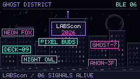

# Cyberputer

A LABScon costume display for the M5Stack Cardputer ADV, based on GhostBLE.

## City mode

The first firmware mode is implemented: a 240×135 neon city with LABScon
signage, advertised BLE names, scrolling signs, discovery flashes and fading
stale observations. From the home screen press **V**, or select **CYBERPUTER →
LABScon Neon City** from the menu.

**S** pauses scanning, **D** sleeps/wakes the screen, **P** shows rendering/heap
metrics, and **Esc/backtick**, **M**, or **Q** returns to the menu. The previous
GhostBLE scan-enabled state is restored on exit.

**A** toggles active scans to request additional BLE names. **B** toggles the
cyberpunk synth loop, **F** toggles discovery/name sounds, **X** silences both,
and **- / =** adjusts city volume. **H** shows the key reference. Audio starts
off and respects GhostBLE's master Audio setting. Active scans do not pair or
connect; some devices still will not supply names.



City has a shared, hardware-independent renderer interface and bounded
observation storage. Radar and signal rain are TODOs; the renderer lookup
rejects them until implemented. A single 4-bit framebuffer needs 16,200 bytes.
The 20 FPS target falls back to 10 FPS if frame cost exceeds its budget.
Actual frame rate and heap stability still need validation on the device.

See [city-mode design, controls and validation](docs/city-mode.md).

## Build

```sh
pio run -d firmware -e ghostble_cardputer
```

The application binary is
`firmware/.pio/build/ghostble_cardputer/firmware.bin`.
This is an application image, not a merged image to flash at address zero.
The initial city build was flashed with approval; the active-name/audio update
is built but not yet flashed. Ask before every flash; no backups unless requested.

Both the unmodified baseline and the city firmware compile successfully.
Host tests cover bounded storage, repeated observations, names, RSSI smoothing,
expiry and clock rollover, unavailable renderers, drawing bounds, and audio
scheduling/mute/effect rate limits:

```sh
cmake -S tests -B build/host
cmake --build build/host
ctest --test-dir build/host --output-on-failure
```

These run with address/undefined-behavior sanitizers on Clang/GCC.

## Repository

`firmware/` is a tracked subtree import of
[GhostBLE](https://github.com/SmonSE/GhostBLE), revision
`0b4ad45c43517395098f103180773e06b3961af4`; its MIT license is retained.
Implementation changes live directly in this repository.
The optional `research/GhostBLE` submodule remains an unchanged baseline
reference. It is not needed to build our firmware. No hosted remote exists.

The supplied setup-wizard bug report concerned GhostESP, a different project.
That fix was excluded after clarification; there is no pending GhostBLE patch.

## Original visual studies

Open [preview/index.html](preview/index.html) directly in a browser for the
three animated concepts. They use synthetic data, exact 240×135 framebuffers,
scale/pause/crowd controls, and PNG export. The original radar/rain concepts
remain here as references for the future firmware modes. LABScon uses custom
pixel lettering rather than the official logo artwork.

The browser preview checks and captures can be reproduced in this environment:

```sh
NODE_PATH=/opt/homebrew/lib/node_modules node preview/capture.cjs
```

## Research notes — 2026-09-12

PlatformIO 6.1.19 and ESP32 toolchains are installed. Arduino CLI 1.4.1 currently
has only its AVR core, so PlatformIO is the build route. An Espressif USB
serial device was observed at `/dev/cu.usbmodem2101`; its firmware was untouched.

The ADV has a 240×135 display, 8 MB flash, 2.4 GHz Wi-Fi and BLE, with no PSRAM.
Bluetooth Classic discovery is unavailable. Passive BLE scanning does not see
names that appear only in active scan responses. City labels unnamed devices
instead of assuming every device broadcasts a name.

| Foundation | Assessment |
| --- | --- |
| [GhostBLE](https://github.com/SmonSE/GhostBLE) | Selected: ADV support, NimBLE, PlatformIO, name/RSSI extraction, MIT license |
| [Bruce](https://github.com/BruceDevices/firmware) | Broader Wi-Fi/BLE toolkit, larger dependency surface, AGPL project |
| [Wi-Fi & BLE Radar ADV](https://github.com/Zeloksa/Cardputer-ADV-WiFi-BLE-Radar) | Useful visual reference, but only compiled binaries published |

Hardware sources: [M5Stack ADV specifications](https://docs.m5stack.com/en/core/Cardputer-Adv)
and [Espressif ESP32-S3 Bluetooth documentation](https://docs.espressif.com/projects/esp-idf/en/stable/esp32s3/api-reference/bluetooth/index.html).
