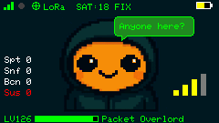
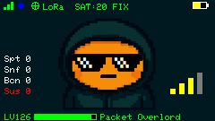
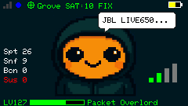

<h1 align="center">
  
</h1>

**A BLE privacy scanner for M5Stack devices**

GhostBLE discovers nearby Bluetooth Low Energy devices, analyzes their privacy posture, and flags potential security concerns. Built for security researchers, ethical hackers, and reverse engineers exploring BLE protocols, as well as tinkerers and educators interested in device fingerprinting, GATT service analysis, and wireless reconnaissance.

A friendly mascot named **NibBLEs** guides you through the scanning process on the built-in display.

        

> [!WARNING]
> GhostBLE is intended for legal and authorized security testing, education, and privacy research only. Use of this software for any malicious or unauthorized activities is strictly prohibited. The developers assume no liability for misuse. Use at your own risk.

---

## BLE Privacy Awareness — Do's & Don'ts

BLE advertising can be read by anyone nearby — no pairing, no authentication, 
no permission needed. GhostBLE exists to find these leaks; here's how to fix 
your own.

### BLE Don'ts
- Don't put your **real name**, **address**, or **function** in a device name
  (e.g. "Garage Door", "John's Front Door Lock").
- Don't leave **vehicle license plates** or **owner names** in your car's BLE
  name — during testing, a Tesla was found broadcasting its owner's full name
  *and* license plate in plain text.
- Don't keep factory-default names on smart home / IoT devices.
- Don't assume "nobody's scanning" — any phone with a free app (nRF Connect,
  LightBlue) sees exactly what GhostBLE sees.

### BLE Do's
- Use a **generic, non-identifying** device name ("Device 42", not "Anna's Car").
- Turn Bluetooth **off** when not in use.
- Change your phone's Bluetooth name manually:
  - **Android:** Settings → Bluetooth → Device name
  - **iOS:** Settings → General → About → Name
- **Scan your own environment** periodically — devices you own may be leaking
  more than you think.
- Keep IoT firmware updated and change default pairing PINs where possible.

### Why it matters
BLE advertising needs no connection to be read. A name is often the easiest,
most overlooked privacy leak in daily life.

---

## Quick Start

1. Flash the firmware (see [Building & Flashing](#building--flashing))
2. Insert a **microSD card** (required on Cardputer for logging and XP)
3. Power on — NibBLEs greets you on the display
4. **Long press BtnG0** (1 second) to start scanning
5. Watch devices appear on the display and in the logs

---

## Supported Hardware

| Device | Platform | Display | Keyboard | SD Card |
|--------|----------|---------|----------|---------|
| **M5Stack Cardputer ADV** | ESP32-S3 | 240×135 LCD | Yes | Yes |
| **M5Stack Cardputer** | ESP32-S3 | 240×135 LCD | Yes | Yes |
| **M5StickS3** | ESP32-S3 | 240×135 LCD | No (2 buttons) | No |

All devices support BLE scanning, GATT connections, GPS wardriving, WiFi dashboard, and PwnBeacon. The Cardputer adds keyboard controls, SD card logging, XP persistence, and screenshot capture.

### 3D printed Cardputer & M5Stick S3 cases
- [M5 Stack Cardputer ADV Hardcase LoRa Cap](https://makerworld.com/de/models/1810263)
- [M5 Cardputer Gaming Case – Gameboy Edition](https://makerworld.com/de/models/2417770)
- [M5Stick S3 SD-Card Expansion Case](https://makerworld.com/de/models/2834473)
- [M5Stick S3 - Minimalist Case](https://makerworld.com/de/models/2826069)
- [M5Stick S3 Backpack Case](https://makerworld.com/de/models/2905806)

---

## Features

### BLE Scanning & Analysis

- **Passive BLE scanning** — discovers nearby devices with signal strength (RSSI) and estimated distance
- **Device info extraction** — retrieves names, service UUIDs, manufacturer data, appearance and TX power
- **GATT connections** — connects to devices and reads standard BLE services (Device Info, Battery, Heart Rate, Temperature, Generic Access, Current Time, TX Power, Immediate Alert, Link Loss)
- **Notification capture** — subscribes to notifiable characteristics and decodes live sensor data (Heart Rate, SpO2, Temperature, CSC, RSC, Glucose, Battery)
- **Advertisement interval fingerprinting** — measures time between advertisements for passive device-class identification

### Beacon Detection

- **iBeacon** — parses UUID, major, minor, TX power and estimates distance
- **Eddystone** — decodes all four frame types:
  - **UID** — 16-byte namespace + instance identifier
  - **URL** — leaks raw URLs (internal hostnames, asset tracker URLs)
  - **TLM** — telemetry data (battery voltage, temperature, uptime)
  - **EID** — ephemeral rotating ID (privacy-aware device)
- **PwnBeacon / Pwnagotchi** — detects and reads PwnGrid beacons (identity, face, pwnd counters)

### Privacy Heuristics

- **Rotating MAC detection** — flags devices using Resolvable Private Addresses (RPA)
- **Cleartext detection** — flags devices leaking unencrypted identifiers
- **Exposure classification** — rates devices into tiers (None, Passive, Active, Consent) with a privacy score
- **Live sensor data streaming** — flags devices broadcasting sensor data without authentication

### Security Analysis

- Analyzes writable **BLE characteristics** and access permissions
- Enumerates **DFU** and **UART** services for protocol inspection and diagnostics
- Checks for **encryption** on sensitive services
- Builds **device fingerprints** from advertised UUIDs and GATT profiles
- **Pairing / bonding state detection** — distinguishes open from bonded devices via ATT error codes

### Find My Tracker Detection & Safety Response

GhostBLE can detect **Apple Find My / Find My Network trackers** and add them to the **Suspicious Devices** list.

For supported trackers, GhostBLE provides a user-controlled **Safety Response**:

- **SEARCH** — locate the tracker using the live RSSI-based Finder Mode
- **SOUND** — attempt to trigger the tracker's built-in sound to help locate it
- **CANCEL** — return without interacting with the device

This feature is intended for **privacy research, anti-stalking research, and locating potentially unwanted tracking devices**. The implementation is unofficial and based on publicly available research and reverse-engineering of the relevant BLE protocols. GhostBLE is not affiliated with or endorsed by Apple.

### Manufacturer & Device Identification

The **Manufacturer Parser** has received a major update with a significantly expanded database of Bluetooth company identifiers and manufacturer information.

GhostBLE can now identify **many more BLE devices and manufacturers**, providing more meaningful device names instead of generic `Unknown` entries.

This improves device fingerprinting and makes the scan results, logs, and security analysis much more useful when investigating unknown BLE devices.

### Parsers

- **Manufacturer parser** — expanded database of Bluetooth company identifiers and manufacturer information.
- **Member Service parser** — 100+ member service UUIDs (Section 3.11): Apple, Google, Samsung, Tesla, Xiaomi, Huawei, Garmin, Polar, Bose, Sennheiser, Medtronic, Abbott, Dexcom and more
- **Appearance parser** — full subcategory decoding (190+ entries from Section 2.6): watches, medical devices, domestic appliances, vehicles, industrial tools, cookware and more
- **SDO Service parser** — Section 3.10 special services: Matter (0xFFF6), Zigbee Direct (0xFFF7), ASTM Drone Remote ID (0xFFFA), Thread (0xFFFB), AirFuel (0xFFFC), FIDO U2F (0xFFFD)

### Known Suspicious Device Detection

- **Flipper Zero** — detected by known service UUIDs
- **CatHack / Apple Juice** — BLE spam tool detection
- **Tesla** — detected via iBeacon UUID, GATT service, and name pattern matching
- **LightBlue** — app-based BLE testing tool detected by known service UUIDs
- **Drones** — ASTM Remote ID detection via SDO service UUID 0xFFFA
- **PwnBeacon / Pwnagotchi** — detects and reads PwnGrid beacons (identity, face, pwnd counters, messages)
- **XiaoBiscuit** — detected by known service UUIDs
- **Card Skimmer** - detected by known device names

### Locate Suspicious Devices

Found a Find My Tracker, skimmer, or other flagged device? GhostBLE doesn't 
just detect it — it helps you find exactly where it is.

1. Open **Sus Devices** from the Main Menu to see everything GhostBLE has 
   flagged (name, MAC, signal strength, time detected).
2. Select any entry with **ENTER** — the main scan pauses automatically, and 
   its MAC address is handed off to **Finder Mode**.
3. Finder Mode scans specifically for that device, showing a live radar 
   display and an accelerating beep as you get closer — walk around and 
   home in on it, no more guessing.

Perfect for tracking down a hidden AirTag, a suspicious BLE module near a 
card reader, or any device you've flagged as worth a closer look.

### Card Skimmer Detection

Bluetooth card skimmers are a growing threat — FICO reported a **700%+ 
increase** in skimming incidents in a single year, and researchers using 
BLE scanners have found dozens of hidden skimmers at gas pumps and ATMs, 
some undetected for months.

Many of these skimmers use cheap, off-the-shelf BLE serial modules 
(HC-05, HC-06, HM-10, etc.) to transmit stolen card data wirelessly — 
often left with their **factory-default name**, since changing it isn't 
necessary for the skimmer to work.

GhostBLE flags these generic module names as a **possible indicator**, 
not proof. These modules are also widely used in harmless DIY/Arduino 
projects, so a match should raise suspicion — especially near a card 
reader or ATM — not trigger alarm on its own.

**If GhostBLE flags a device near a payment terminal:** don't insert your 
card, and report it to the location owner or authorities. Never open or 
tamper with the terminal yourself.

### Drone Remote detection ID (ASTM F3411-22a)

When a drone broadcasting Remote ID is detected via BLE service `0xFFFA`:

```
[#3] SDO Match: ASTM Remote ID (ASTM Remote ID)
[#3] ASTM F3411 Remote ID (v2)
   Type:        Helicopter / Multirotor
   Serial:      1ZNDBK20D00089
   Operator ID: DEU-HH-123456
   Status:      Airborne
   Drone GPS:   48.123456, 8.654321
   Alt (geo):   87.5 m
   Alt (baro):  85.0 m
   Height:      42.0 m (above takeoff)
   Speed H:     3.5 m/s
   Speed V:     0.0 m/s
   Heading:     270 deg
   H-Acc:       <10 m
   Pilot GPS:   48.120000, 8.650000    ← pilot standing here
   Pilot Alt:   382.5 m
   EU Class:    C1
   Description: Delivery drone — authorized flight
```

> Remote ID is mandatory for drones >250g in the EU (2019/947) and US (FAA Part 89)
> since 2023. GhostBLE decodes all six ASTM F3411-22a message types: Basic ID,
> Location, Authentication, Self-ID, System (operator GPS), and Operator ID.

### PwnBeacon (not working in stealth mode)

GhostBLE acts as both a PwnBeacon **client** (scanner) and **server** (advertiser), compatible with [PwnBook](https://github.com/pfefferle/PwnBook) and [Palnagotchi](https://github.com/pfefferle/palnagotchi):

- Advertises as a PwnBeacon with SHA-256 fingerprint, identity JSON, face, and device name
- Detects nearby PwnBeacon peers via advertisement service data
- Reads full peer info via GATT (identity, face, name, message)
- Signal/ping characteristic for peer interaction
- Pwnd counters update dynamically during scanning

### Manufacturer Identification

Decodes manufacturer data for Apple, Google, Samsung, Epson, and more. Also parses **iBeacon** advertisements (UUID, major, minor, TX power, distance).

### GPS & Wardriving

- **Dual GPS support** — Grove UART and LoRa cap GPS (Cardputer only for LoRa)
- **WiGLE CSV export** — log devices with location for mapping and analysis
- **GeoJSON export** — RSSI heat map for direct import into QGIS or Google Maps

### Start Wardriving

1. Power on GhostBLE
2. Press `TAB`
3. Select GPS source with `DEL`
   - Grove GPS
   - LoRa GPS
4. Press `BtnG0` to start wardriving

### Logging

All findings are logged to multiple channels simultaneously:

| Channel | Details |
|---------|---------|
| **Serial** | 115200 baud, structured output |
| **SD card** | Per-category log files (Cardputer only) |
| **Web dashboard** | Real-time via WiFi AP and WebSocket |

Log categories: Scan, GATT, Privacy, Security, Beacon, Control, GPS, System, Target, Notify. Each device gets a **session ID** for cross-log correlation.

## Device Deep-GATT-Logging

Beyond the normal scan cycle (Connect → Read → Disconnect), GhostBLE offers
a dedicated **Device-GATT-logging mode** for individual devices: the connection is
kept open and every interaction — services, characteristics,
notifications/indications, changing values — is continuously logged to the
SD card.

### Usage

1. Open **"View Connected Devices"** in the main menu.
2. Select a device → **"START LOG"**.
3. The main scan stops automatically, GhostBLE reconnects to the chosen
   device, and logging begins.
4. An info screen shows runtime, connection status, and event counts.
5. **Select** on the info screen stops the session manually (it also ends
   automatically if the device disconnects). The main scan resumes
   afterward.

### Log format

Written to `/GhostBLE/detailed.log`:

- **Baseline dump** on connect: all services/characteristics with access
  flags (`R`/`W`/`N`/`I`) and initial values.
- **`[NOTIFY]` / `[INDICATE]`**: incoming pushed data, logged on change.
- **`[CHANGED]`**: polled readable characteristics, logged on change.
- **`Disconnected, reason = ...`**: HCI disconnect reason.

Chatty characteristics (e.g. motion sensors) are throttled to one log entry
per 200 ms.

### XP System

GhostBLE gamifies the scanning process with experience points:

| Event | XP |
|-------|-----|
| Device discovered | +0.1 |
| GATT connection success | +0.5 |
| Characteristic subscription | +1.0 |
| PwnBeacon detected | +1.0 |
| Notify data (unknown char) | +1.5 |
| Manufacturer data decoded | +2.0 |
| Suspicious device found | +2.0 |
| Known characteristic decoded | +2.5 |
| iBeacon parsed | +3.0 |

XP is persisted to the SD card (Cardputer) and shown on the display with level progression.

### NibBLEs

NibBLEs is the on-screen mascot with context-sensitive expressions and speech bubbles:

- **Expressions** — happy, sad, angry, glasses (detective), thug life, sleeping, hearts, and more
- **Speech bubbles** — context-aware messages for idle, scan start, wardriving, suspicious finds, and level-ups
- **Screenshot capture** — press ENTER on Cardputer to save the current display to SD
- **Display sleep** — NibBLEs pauses animations when a web client is connected

---

## Controls

### Cardputer (Keyboard)

| Key | Action |
|-----|--------|
| **Long press BtnG0** (1s) | Toggle BLE scanning on/off |
| **FN** | Toggle WiFi AP and web dashboard |
| **TAB** | Toggle wardriving mode |
| **DEL** | Switch GPS source (Grove / LoRa) |
| **D** | Display sleep / wakeup |
| **F** | BLE device finder |
| **I** | Image / screenshot |
| **M** | Main Menu with all settings |
| **P** | Pointer in log file |
| **R** | Research mode |
| **S** | Scan mode |

### M5StickS3 (Buttons)

| Button | Action |
|--------|--------|
| **BtnA short press** | Navigate down in Main Menu |
| **BtnA long press** (3s) | Toggle BLE scanning on/off |
| **BtnB short press** | Select / toggle item in Main Menu |
| **BtnB long press** (3s) | Open / close Main Menu |

### M5StickS3 — External SD Card Wiring

The M5StickS3 has no built-in SD slot, so an external SPI Micro SD reader 
module is wired directly to the available GPIOs.

| SD Reader Pin | M5StickS3 GPIO | Define             |
|----------------|----------------|---------------------|
| CS             | G8             | `SD_CS_PIN`         |
| MOSI           | G1             | `SD_MOSI_PIN`       |
| SCK            | G0             | `SD_CLK_PIN`        |
| MISO           | G4             | `SD_MISO_PIN`       |
| GND            | GND            | —                   |
| VCC            | 3V3            | —                   |

```cpp
#define SD_CS_PIN    8   // G8
#define SD_MOSI_PIN  1   // G1
#define SD_CLK_PIN   0   // G0
#define SD_MISO_PIN  4   // G4
```

> ⚠️ These GPIOs are shared with other peripherals on some board revisions 
> (e.g. LoRa module). GhostBLE deselects the LoRa chip select pin before 
> initializing the SD card to free the shared SPI bus — see `setup()`.

### Web Dashboard

1. Enable WiFi (**FN** on Cardputer or **BtnA** on StickS3)
2. Connect to WiFi AP **`GhostBLE`** (password: **`ghostble123!`**)
3. Open **`192.168.4.1`** in a browser
4. Change Settings for wifissid, wifipwd and device name 

Real-time BLE device discovery via WiFi Access Point and WebSocket:

- **Live device cards** — RSSI signal strength with color coding (green/amber/red), device type tags (CONN, iBeacon, PWN, NOTIFY, SUS)
- **Trace log** — color-coded by category (scan, gatt, security, beacon, notify, privacy)
- **Stats bar** — live counters for Spotted / Suspicious / Beacons / PwnBeacons
- **Device filter** — filter cards by name or MAC address
- **Settings panel** — configure device name, face, WiFi SSID and password
- **Auto-reconnect** — WebSocket reconnects automatically after BLE scan interruptions
- **Display sleep** — display turns off automatically when a web client connects to save resources

---

## Architecture

GhostBLE uses a layered architecture with namespaced context objects replacing global variables:

```
src/app/context/
├── scan_context.*      # BLE scan state, device dedup, counters (thread-safe atomics)
├── ui_context.*        # NibBLEs animations, display state, FreeRTOS task handles
├── network_context.*   # WiFi/WebSocket, wardriving, GPS, WiGLE logger
└── device_context.*    # DeviceConfig, XPManager, beacon counters
```

Threading model: BLE scanning runs on Core 1 via FreeRTOS. Variables shared between cores use `std::atomic<>`. UI and network operations run on Core 0 (Arduino loop).

---

## Building & Flashing

### PlatformIO (Recommended)

```bash
# Cardputer
pio run -e ghostble -t upload

# M5StickS3
pio run -e ghostble-sticks3 -t upload

# Run unit tests (native / Google Test)
pio test -e native -v
```

### Arduino IDE

1. Install the **M5Stack board package** via Board Manager
2. Select the appropriate board for your device
3. Install required libraries via Library Manager:
   - `M5Cardputer` / `M5Unified` — hardware abstraction
   - `NimBLE-Arduino` — BLE stack
   - `ESPAsyncWebServer`, `AsyncTCP` — web dashboard
   - `TinyGPSPlus` — GPS parsing
4. Open `GhostBLE.ino`, compile, and upload

---

## Sample Output
### Printer Epson
```
[#17] Advertised Services (1):
     - fe78 (Member Service — Woan Technology)
[#17] Connected and discovered attributes: be:e9:2f:33:47:f1
[#17] Reading Generic Access Service (0x1800)
   Device Name: ENVY Photo 6200 series
   Appearance: Unknown (0x0)
[#17] Device info
   Address:  be:e9:2f:33:47:f1
   Name:     ENVY Photo 6200 series
   Manuf.:   HP, Inc.
   Raw GATT:
     - IPv4 Address = (192.168.178.53)
     - IPv6 Address = (2A02:8071:2287:5B20:BEE9:2FFF:FE33:C7F1)
     - Device UUID
   Distance: ~19.95 m
   RSSI:     -95 dBm
[#17] Exposure summary
   Device type:       Printer / IoT Device
   Identity exposure: HIGH — IP address leaked via GATT
   Tracking risk:     HIGH — static MAC + identity data
   Privacy level:     VERY POOR
```
### Garmin Venu2
```
[#3] Advertised services (1):
     - 180d (Heart Rate Service)
[#3] Connected and discovered attributes: 90:f1:57:f6:15:ac
[#3] Reading Generic Access Service (0x1800)
   Device found: Venu 2 [90:f1:57:f6:15:ac]
   Generic Access Service found (0x1800)
     Read value of generic access info
     Device Name: Venu 2
     Appearance: Sports Watch (0xc1)
     PPCP - Min: 24, Max: 36, Latency: 0, Timeout: 400
     Central Address Resolution: Not Supported
     Generic Attribute Service detected (0x1801)
     Service Changed: Supported (indicate)
   Heart Rate Service
     Heart Rate Service found (0x180D)
     Subscribed to Heart Rate notifications
     ❤️ Heart Rate: 73 bpm
     ❤️ Heart Rate: 72 bpm
     ❤️ Heart Rate: 71 bpm
     ❤️ Heart Rate: 71 bpm
     ❤️ Heart Rate: 69 bpm
     ❤️ Heart Rate: 69 bpm
     ❤️ Heart Rate: 66 bpm
     ❤️ Heart Rate: 66 bpm
     Unknown Service (0x6a4e8022-667b-11e3-949a-0800200c9a66)
       Char 6a4e4c80-667b-11e3-949a-0800200c9a66 []
       Char 6a4ecd28-667b-11e3-949a-0800200c9a66 [RN]
     Unknown Service (0x6a4e2800-667b-11e3-949a-0800200c9a66)
       Char 6a4e2803-667b-11e3-949a-0800200c9a66 [RW]
       Char 6a4e2810-667b-11e3-949a-0800200c9a66 [RWN]
       Char 6a4e2820-667b-11e3-949a-0800200c9a66 [W]
       Char 6a4e2811-667b-11e3-949a-0800200c9a66 [RWN]
       Char 6a4e2821-667b-11e3-949a-0800200c9a66 [W]
       Char 6a4e2812-667b-11e3-949a-0800200c9a66 [RWN]
       Char 6a4e2822-667b-11e3-949a-0800200c9a66 [W]
       Char 6a4e2813-667b-11e3-949a-0800200c9a66 [RWN]
       Char 6a4e2823-667b-11e3-949a-0800200c9a66 [W]
       Char 6a4e2814-667b-11e3-949a-0800200c9a66 [RWN]
       Char 6a4e2824-667b-11e3-949a-0800200c9a66 [W]
     Unknown Service (0x1814)
       Char 0x2a54 [R] (len=2) = 00 00 
       Char 0x2a53 [N]
[#3] No target detected via GATT: 90:f1:57:f6:15:ac
[#3] Device info
   Address:  90:f1:57:f6:15:ac
   Name:     Venu 2
   Manuf.:   
   Raw GATT:
     - Venu 2
   Distance: ~1.00 m
   RSSI:     -69 dBm
```
---

## Project Structure

```
GhostBLE/
├── src/
│   ├── app/
│   │   ├── context/         # Scan, UI, Network, Device context
│   │   ├── gamification/    # XP system
│   │   └── interaction/
│   ├── assets/              # NibBLEs sprite assets
│   ├── config/              # App, detection, signal config
│   ├── core/
│   │   ├── analyzer/        # Exposure, security, privacy analyzers
│   │   ├── detection/       # Known device detection
│   │   ├── fingerprint/     # Device fingerprinting
│   │   ├── models/          # DeviceInfo, ExposureResult
│   │   └── parsing/         # Appearance, service, SDO, Eddystone parsers
│   ├── infrastructure/
│   │   ├── ble/             # Scanner, GATT handlers, Eddystone
│   │   ├── gps/             # GPS manager
│   │   ├── logging/         # Multi-target logger
│   │   ├── platform/        # Hardware abstraction
│   │   └── wardriving/      # WiGLE logger
│   ├── ui/
│   │   ├── expression/      # NibBLEs animations
│   │   ├── icons/           # Status icons
│   │   └── overlay/         # Draw helpers
│   └── web/                 # Web dashboard, WebSender, LogReplayer
├── test/
│   ├── mocks/               # Arduino stubs for native builds
│   └── test_exposure/       # Google Test suite for exposure analyzer
└── platformio.ini
```

---

## Contributing

PRs and suggestions welcome. This is a learning-focused BLE privacy project — ideas, bug reports, and new device signatures are all appreciated.

## License

MIT License
