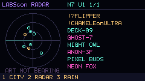
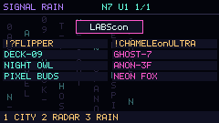
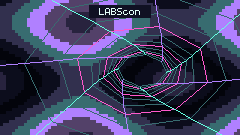

# Cyberputer

Cyberpunk BLE visuals and an SD soundtrack for the **M5Stack Cardputer ADV**,
built on [GhostBLE](https://github.com/SmonSE/GhostBLE).

## Scenes

| Scene | Display |
| --- | --- |
| Neon city | Live device names on neon buildings and signs |
| Neon radar | Device list and a decorative scope |
| Signal rain | Falling glyphs and paged device names |
| Neon Odyssey | Plasma, twisting tunnel, rotating circuitry and warp field |

Screenshots use the firmware renderer with synthetic test observations.
Firmware displays live BLE observations, not simulated devices.

Cyberputer boots into city. Scenes share live observations and uninterrupted
SD audio, with a device-free eye-candy scene for pure decoration.
GhostBLE utilities remain available in the menu.

## Get started

1. [Build and install the firmware](docs/building.md).
2. [Set up the SD soundtrack](docs/soundtrack.md).
3. Use the [keymap](docs/keymap.md), also available in on-device help.

The supported Cyberputer target is the Cardputer ADV. Inherited board
configurations are not a support claim.

## Documentation

| Guide | Contents |
| --- | --- |
| [Keymap](docs/keymap.md) | All keyboard controls and mode defaults |
| [Visualizations](docs/visualizations.md) | Scenes, observations, names and rendering limits |
| [Watchlist](docs/device-watchlist.md) | Detection signatures, highlighting and interpretation |
| [Soundtrack](docs/soundtrack.md) | SD setup, custom recordings and playback behavior |
| [Build and installation](docs/building.md) | Toolchain, firmware images and USB installation |
| [Contributing](CONTRIBUTING.md) | Tests, architecture and versioning |
| [Security and privacy](SECURITY.md) | Data handling and safety limitations |

## License and credits

Cyberputer code is [MIT licensed](LICENSE). GhostBLE's original
[MIT notice](firmware/LICENSE) is retained. Bundled audio and linked libraries
keep their own licenses. See [third-party notices and credits](THIRD_PARTY_NOTICES.md).

LABScon lettering is custom pixel artwork; no conference or vendor endorsement
is implied.
